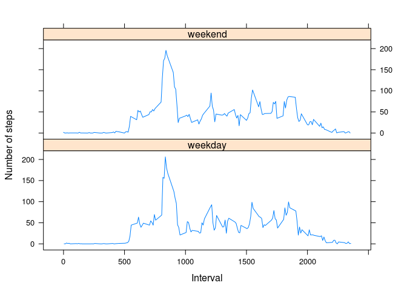

# Reproducible Research: Peer Assessment 1


## Loading and preprocessing the data
Load data using read.csv.

```r
data <- read.csv("~/Documents/Coursera/ReproducibleResearch/activity.csv", header=TRUE, colClasses=c(numeric(), character(),numeric()), stringsAsFactors=FALSE)
```
1. Look briefly at the data.

```r
head(data)
```

```
##   steps       date interval
## 1    NA 2012-10-01        0
## 2    NA 2012-10-01        5
## 3    NA 2012-10-01       10
## 4    NA 2012-10-01       15
## 5    NA 2012-10-01       20
## 6    NA 2012-10-01       25
```

```r
str(data)
```

```
## 'data.frame':	17568 obs. of  3 variables:
##  $ steps   : int  NA NA NA NA NA NA NA NA NA NA ...
##  $ date    : chr  "2012-10-01" "2012-10-01" "2012-10-01" "2012-10-01" ...
##  $ interval: int  0 5 10 15 20 25 30 35 40 45 ...
```

```r
summary(data)
```

```
##      steps            date              interval     
##  Min.   :  0.00   Length:17568       Min.   :   0.0  
##  1st Qu.:  0.00   Class :character   1st Qu.: 588.8  
##  Median :  0.00   Mode  :character   Median :1177.5  
##  Mean   : 37.38                      Mean   :1177.5  
##  3rd Qu.: 12.00                      3rd Qu.:1766.2  
##  Max.   :806.00                      Max.   :2355.0  
##  NA's   :2304
```
2. Transform second column date from chracter variable to Date class.

```r
data$date <- strptime(data$date, "%Y-%m-%d")
data$date <- as.Date(data$date)
```
## What is mean total number of steps taken per day?

Calculate total number of steps per day by summing variable 'steps' grouped by variable 'date'.

```r
dataDay <- as.data.frame(aggregate(steps ~ date, data, sum))
```
1. Make a histogram of the total number of steps taken each day

```r
hist(dataDay$steps, main = "Histogram of number of steps per day", xlab="Number of steps per day")
```

 
  
2. Calculate and report the mean and median total number of steps taken per day.

```r
summary(dataDay$steps, na.rm=TRUE, digits = max(3, getOption("digits")-2))
```

```
##    Min. 1st Qu.  Median    Mean 3rd Qu.    Max. 
##      41    8841   10765   10766   13294   21194
```
Mean number of steps per day is 10766, median number of steps is 10765.

## What is the average daily activity pattern?

1.Make a time series plot (i.e. type = "l") of the 5-minute interval (x-axis) and the average number of steps taken, averaged across all days (y-axis)

```r
dataInterval <- as.data.frame(aggregate(steps ~ interval, data, mean))
plot(dataInterval$interval, dataInterval$steps, type = "l", xlab="5-minute interval", ylab="Number of steps")
```

 

2. Which 5-minute interval, on average across all the days in the dataset, contains the maximum number of steps?

```r
maxRow <- dataInterval[which.max(dataInterval[,2]),]
maxRow
```

```
##     interval    steps
## 104      835 206.1698
```

```r
maxInterval <- maxRow[,1]
```
Interval 835 contains maximum number of steps.

## Imputing missing values
Note that there are a number of days/intervals where there are missing values (coded as NA). The presence of missing days may introduce bias into some calculations or summaries of the data.

1. Calculate and report the total number of missing values in the dataset (i.e. the total number of rows with NAs)

```r
naNumber = nrow(data)-sum(complete.cases(data))
```

Total number of rows containing missing (NA) values is 2304.

2. Devise a strategy for filling in all of the missing values in the dataset. The strategy does not need to be sophisticated. For example, you could use the mean/median for that day, or the mean for that 5-minute interval, etc.
3. Create a new dataset that is equal to the original dataset but with the missing data filled in.

I decided to fill in NA values by mean values for corresponding 5-minute interval.

```r
data2<- data
for (i in 1:nrow(data2)){
    if (is.na(data2[i,1])){
        stepInterval <- data2[i,3]
        data2[i,1] <- dataInterval[dataInterval$interval == stepInterval, 2]
    }
} 
```

4. Make a histogram of the total number of steps taken each day and Calculate and report the mean and median total number of steps taken per day. Do these values differ from the estimates from the first part of the assignment? What is the impact of imputing missing data on the estimates of the total daily number of steps?

```r
data2Day <- as.data.frame(aggregate(steps ~ date, data2, sum))
hist(data2Day$steps, main = "Histogram of number of steps per day", xlab="Number of steps per day")
```

 

```r
summary(data2Day$steps, na.rm=TRUE, digits = max(3, getOption("digits")-2))
```

```
##    Min. 1st Qu.  Median    Mean 3rd Qu.    Max. 
##      41    9819   10766   10766   12811   21194
```
Distribution of step numbers per day changed, although a little. First, third quartile and median values changed, mean value remained unchanged.
In my opinion, the difference between step number distribution could be best showen by boxplot.

```r
boxplot(dataDay$steps, data2Day$steps, names=c("NA values", "NA values imputed"), main="Comparison on step number per day distribution")
```

 
  
## Are there differences in activity patterns between weekdays and weekends?

For this part the weekdays() function may be of some help here. Use the dataset with the filled-in missing values for this part.

1. Create a new factor variable in the dataset with two levels -- "weekday" and "weekend" indicating whether a given date is a weekday or weekend day.

```r
data2$day <- weekdays(data2$date, abbreviate = TRUE)
data2$weekday <- ifelse(data2$day == "Sat" || data2$day == "Sun", "weekend","weekday")
data2$weekday <- factor(data2$weekday, levels=c("weekday", "weekend"))
```

2. Make a panel plot containing a time series plot (i.e. type = "l") of the 5-minute interval (x-axis) and the average number of steps taken, averaged across all weekday days or weekend days (y-axis). 

First I needed to change weekday display to English.

```r
Sys.setlocale("LC_TIME", "C")
```
Then I created "weekday" factor variable containing two levels with following labels: "weekend", "weekday".


```r
data2$day <- weekdays(data2$date, abbreviate = TRUE)
data2$weekday <- factor(ifelse(data2$day == "Sat" || data2$day == "Sun", "weekend","weekday"), levels=c("weekend","weekday"), labels=c("weekend","weekday"))
data2Mean <- as.data.frame(aggregate(steps ~ interval+weekday, data2, mean))
```
In order to create plot, I used "lattice" package.
For plotting, data were grouped by "weekday" variable.

```r
library(lattice)
xyplot(data2Mean$steps ~ data2Mean$interval | levels(data2Mean$weekday), type="l", layout = c(1, 2), xlab="Interval", ylab="Number of steps")
```

 

